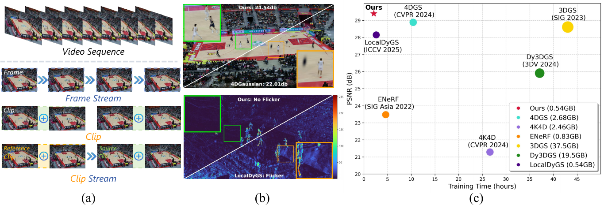
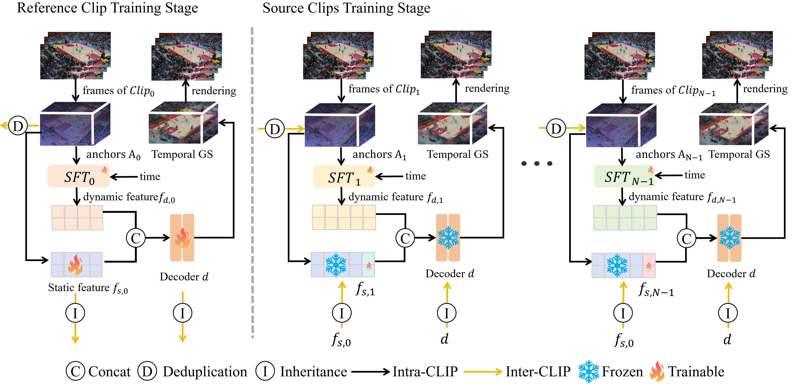

# ClipGStream (CVPR 2026)
### [Project page](https://liangjie1999.github.io/ClipGStreamWeb/) | [Paper](https://arxiv.org/abs/2604.13746) | [Long 360](https://huggingface.co/datasets/BestWJH/VRU_Basketball/tree/main) | [VRU Dataset](https://huggingface.co/datasets/BestWJH/VRU_Basketball/tree/main)
> **ClipGStream: Clip-Stream Gaussian Splatting for Any Length and Any Motion
Multi-View Dynamic Scene Reconstruction**,            
> Jie Liang, Jiahao Wu, Chao Wang, Jiayu Yang, Xiaoyun Zheng, Kaiqiang Xiong, Zhanke Wang, Jinbo Yan, FengGao, Ronggang Wang  
> **Guangdong Provincial Key Laboratory of Ultra High Definition Immersive Media Technology,
Shenzhen Graduate School, Peking University, Pengcheng Lab, Peking Unviersity**  
> **CVPR 2026**
> 
This repository is the official implementation of **"ClipGStream: Clip-Stream Gaussian Splatting for Any Length and Any Motion
Multi-View Dynamic Scene Reconstruction"**. 


In this paper, we propose a hybrid reconstruction framework, Clip-Stream, which performs stream-level optimization at the clip granularity rather than at the frame level. This design enables scalable and temporally coherent reconstruction of long dynamic sequences, effectively eliminating flickering artifacts.






## 1. Environmental Setups

We tested on a server configured with Ubuntu 20.04, cuda 11.8 and gcc 11.4.0. Other similar configurations should also work, but we have not verified each one individually.  `In fact, this environment configuration is not strict — any environment that can run 3DGS properly should also be able to run our program`. In addition, some extra packages are required, such as Tinycudann.

1. Clone this repo:

```bash
git clone https://github.com/liangjie1999/ClipGStream --recursive
cd ClipGStream
```

2. Install dependencies

```bash
conda env create --file environment.yml
conda activate ClipGStream
```

After that, you need to install [tiny-cuda-nn (1.7)](https://github.com/NVlabs/tiny-cuda-nn/?tab=readme-ov-file#pytorch-extension). 


## 2. Quick Start Guide

**Quickly launch using only a single command.**

We provide a tiny dataset (20 frames) for quick demonstration. This dataset includes multi-view images and has been fully preprocessed. We will use frames 0-10 as the Reference Clip and frames 10-20 as the Source Clip.

### Download the Dataset
Download the dataset from our [GitHub Releases](https://github.com/liangjie1999/ClipGStream/releases/tag/v1.0.0)
### Dataset Structure
```
long_360_tiny_dataset
|---frame000000
|---frame000001
|   |---images
|       |---<image 1>
|       |---...
|---frame000002  
|---...
|---sparse                  # information of camera    
|---plys
    |--- 0.ply              # point cloud of reference clip
    |--  1.ply              # point cloud of source clip (residual point cloud)
```
### Running the Demo
You need to first set the source_path (dataset address) in the runTinyDataset.sh file, and then run the following bash.
```
./scripts/tiny_long_360/run.sh
```

### Expected Results
You can see the results in ./output/tiny_long_360, and the result structure are as follow:
```
|--- history
|    |--- decoder
|         |--- mlp_color.pth
|         |--- mlp_cov.pth
|         |--- mlp_offset.pth
|         |--- mlp_opacity.pth
|    |--- point
          |--- 0.ply
          |--- 1.ply
|    |--- FDHash_0.pth
|    |--- FDHash_1.pth
|--- test
|    |--- renders         # render images
|    |--- videos          # render videos
|    |--- 0.csv           # metrics of test view 0
|    |--- 1.csv
|    |--- 2.csv
|    |--- 3.csv
```
Here we also show our tiny dataset's quantitative results (in 0.csv, 1.csv...)
| Test View | PSNR  | DSSIM1 | DSSIM2 | LPIPS |
|-------|-------|--------|--------|-------|
| 0     | 22.90 | 0.101  | 0.043  | 0.197 |
| 1     | 23.68 | 0.100  | 0.043  | 0.210 |
| 2     | 24.80 | 0.091  | 0.038  | 0.194 |
| 3     | 22.50 | 0.129  | 0.060  | 0.237 |
| AVG      | 23.47 | 0.105  | 0.046  | 0.209 |


## Long 360 Dataset
### Download the Dataset
Download the dataset from our [GitHub Releases](https://github.com/liangjie1999/ClipGStream/releases/tag/v1.0.0)

### Preprocess the Dataset
For the Long 360 dataset, we provide a portion of the processed data here, which includes the camera pose of the first frame (frame 0) and the point clouds of all clips: Basketball_gz_cameras_pointcloud.zip. The additional steps you need to carry out are simply running [this script](https://github.com/liangjie1999/ClipGStream/tree/main/data_process/long360/run.sh) Step 1 to convert videos to images. And then running Step 3 and Step 4 to perform undistortion on the remaining frames and correctly configure the data paths.

### Dataset Structure
```
long_360_tiny_dataset
|---frame000000
    |--- sparse             # information of camera    
    |--- images             # undistorted image
|---view000.mp4
|---view001.mp4
|   ...
|---view035.mp4  
|---...
|---sparse                  
|---plys
    |--- 0.ply              # point cloud of reference clip
    |--  1.ply              # point cloud of source clip 1 (residual point cloud)
    |    ...
    |--  n.ply              # point cloud of source clip n
  
     
```
### Training & Render & Metric

```
./scripts/long_360/trainReferenceClip.sh
./scripts/long_360/trainSourceClip.sh       # if you have multiple GPUs, you can run ./scripts/long_360/parallel_source_clip/generateTrainingCmd.py
./scripts/render.sh                         # render & metric
```

### Expected Results
| Test View | PSNR  | DSSIM1 | DSSIM2 | LPIPS |
|-----------|-------|--------|--------|-------|
| 0         | 24.03 | 0.069  | 0.032  | 0.122 |
| 1         | 24.95 | 0.068  | 0.031  | 0.135 |
| 2         | 26.57 | 0.059  | 0.025  | 0.117 |
| 3         | 22.86 | 0.111  | 0.053  | 0.183 |
| AVG       | 24.60 | 0.077  | 0.035  | 0.139 |


## Custom Dataset
We provide a method to process custom data (multi-view video streams) into our dataset format. For details, please refer to [`data_process/custom_dataset/`](./data_process/custom_dataset/README.md)

## Training
Taking training on the tiny_long_360 dataset as an example (`./scripts/tiny_long_360/`), we divide 20 frames of multi-view images in order into 2 clips, each with a length of 10. The first clip is the Reference Clip, and subsequent clips are Source Clips. Training consists of two steps:
1. Train the Reference Clip: The Reference Clip serves as a foundational representation of the scene, which will be inherited by subsequent clips to prevent flickering issues between clips. The following parameters are used: `clip_size` sets the length of a single clip, `project_total_frames` defines the total sequence length, and `frames_start_end` specifies the start and end frames for the Reference Clip.

```
CUDA_VISIBLE_DEVICES=1 trainReferenceClip.py --project_total_frames 20 --clip_size 10 --iterations 5000 -s "/data8/dataset/longvideos/jpg/long_360_tiny_dataset/" -m ./output/tiny_long_360 --frames_start_end 0 10 --configs arguments/tiny/basketball.py 

python trainReferenceClip.py --project_total_frames 20 /               # N: input video frame count
                             --clip_size 10  /                         # M: frame count of single clip
                             --frames_start_end 0 10 /                 # start frames and end frames
                             --iterations 5000 /
                             -s "/amax/long_360_tiny_dataset/" /
                             -m ./output/tiny_long_360 /
                             --configs arguments/tiny/basketball.py 

```
2. Subsequent Source Clips are trained by inheriting the static information (including anchors, static features, and the decoder) from the Reference Clip. The `-m` parameter should be set the same as when training the Reference Clip, to inherit the static information. Additionally, the `frames_start_end` needs to be adjusted accordingly. Note that the training of each Source Clip is independent, thus it can be parallelized to improve training speed
```
CUDA_VISIBLE_DEVICES=1 python trainSourceClip.py --project_total_frames 20 --clip_size 10 --iterations 5000 -s "/data8/dataset/longvideos/jpg/long_360_tiny_dataset/" -m ./output/tiny_long_360 --frames_start_end 10 20 --configs arguments/tiny/basketball.py 

python trainSourceClip.py  --project_total_frames 20 /               # N: input video frame count
                           --clip_size 10  /                         # M: frame count of single clip
                           --frames_start_end 0 10 /                 # start frames and end frames 
                           --iterations 5000 /
                           -s "/amax/long_360_tiny_dataset/" /
                           -m ./output/tiny_long_360 /
                           --configs arguments/tiny/basketball.py 

```
## Render
```
CUDA_VISIBLE_DEVICES=1 python render.py --project_total_frames 20 --clip_size 10 -s $source_path --iteration $iteration -m ./output/tiny_long_360 --frames_start_end 0 20 --configs arguments/tiny/basketball.py --skip_video --skip_train 

python render.py --project_total_frames 20 /               # N: input video frame count
                 --clip_size 10  /                         # M: frame count of single clip
                 --frames_start_end 0 20 /                 # start frames and end frames of All clips
                 --iteration 5000 /
                 -s "/amax/long_360_tiny_dataset/" /
                 -m ./output/tiny_long_360 /
                 --configs arguments/tiny/basketball.py /
                 --skip_train   /
                 --skip_video

```
## Metrics
```
python metrics.py -m ./output/tiny_long_360 --iteration 5000
```

## Image2Video
```
python images2video.py -m ./output/tiny_long_360/ --iteration 5000
```


## Citation

```
@misc{liang2026clipgstreamclipstreamgaussiansplatting,
      title={ClipGStream: Clip-Stream Gaussian Splatting for Any Length and Any Motion Multi-View Dynamic Scene Reconstruction}, 
      author={Jie Liang and Jiahao Wu and Chao Wang and Jiayu Yang and Xiaoyun Zheng and Kaiqiang Xiong and Zhanke Wang and Jinbo Yan and Feng Gao and Ronggang Wang},
      year={2026},
      eprint={2604.13746},
      archivePrefix={arXiv},
      primaryClass={cs.CV},
      url={https://arxiv.org/abs/2604.13746}, 
}
@article{wu2025localdygs,
  title={LocalDyGS: Multi-view Global Dynamic Scene Modeling via Adaptive Local Implicit Feature Decoupling},
  author={Wu, Jiahao and Peng, Rui and Jiao, Jianbo and Yang, Jiayu and Tang, Luyang and Xiong, Kaiqiang and Liang, Jie and Yan, Jinbo and Liu, Runling and Wang, Ronggang},
  journal={arXiv preprint arXiv:2507.02363},
  year={2025}
}
```